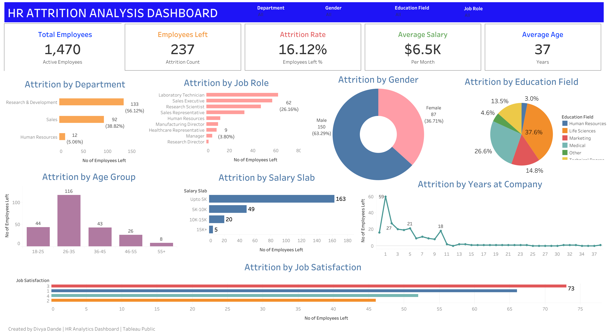

# 👥 HR Analytics Dashboard

An interactive HR analytics dashboard built using Tableau to analyze employee attrition patterns and identify workforce trends across departments, job roles, demographics, salary levels, tenure, and job satisfaction.

## 📊 Project Overview

This project analyzes employee attrition using an HR dataset containing information about employee demographics, job roles, compensation, tenure, education, job satisfaction, and attrition status.

The dashboard was designed to answer business-focused questions such as:

- Which departments have the highest attrition?
- Which job roles experience higher employee turnover?
- Which age groups have the highest attrition?
- How does salary level relate to attrition?
- Does employee tenure influence attrition?
- Which education fields have higher attrition?
- How does job satisfaction vary among employees who leave?

## Dashboard Preview

## 📌 Key KPIs

| KPI | Value |
|---|---:|
| Total Employees | 1,470 |
| Employees Left | 237 |
| Attrition Rate | 16.12% |
| Average Salary | $6.5K |
| Average Age | 37 |

## 🔍 Analysis Areas

The dashboard analyzes employee attrition across multiple dimensions:

### Organizational Analysis
- Attrition by Department
- Attrition by Job Role
- Attrition by Years at Company

### Employee Demographics
- Attrition by Gender
- Attrition by Age Group
- Attrition by Education Field

### Compensation & Satisfaction
- Attrition by Salary Slab
- Attrition by Job Satisfaction

## 📈 Key Insights

- **Research & Development** has the highest attrition count among departments.
- Employees in the **up-to-5K salary slab** show the highest attrition.
- The **26–35 age group** accounts for the highest employee attrition.
- **Laboratory Technicians and Sales Executives** show relatively higher attrition among job roles.
- Attrition is concentrated among employees in their **early years at the company**.

## 🛠️ Tools & Technologies

- **Tableau Public** — Dashboard development and interactive visualization
- **Excel / CSV** — Dataset and data preparation
- **Data Analysis** — Exploratory analysis and KPI analysis
- **Data Visualization** — Charts, comparisons, and dashboard design
- **HR Analytics** — Employee attrition and workforce analysis

## Created By
Divya Dande
